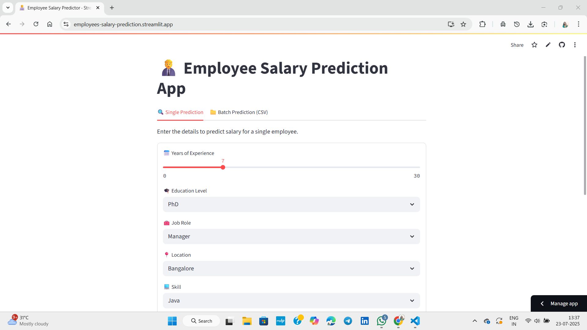
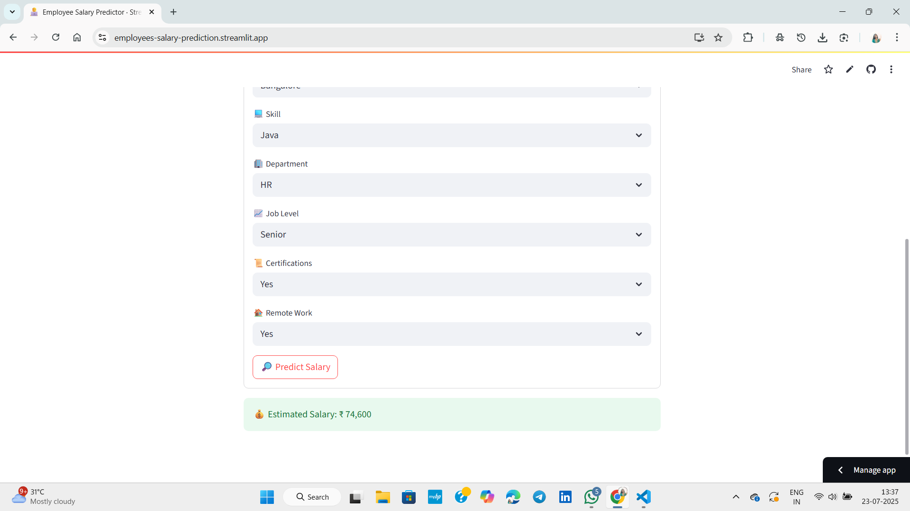
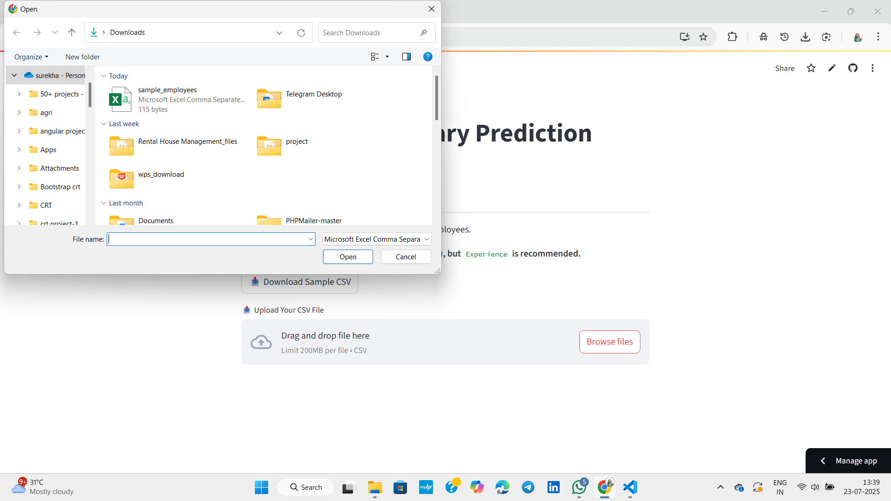
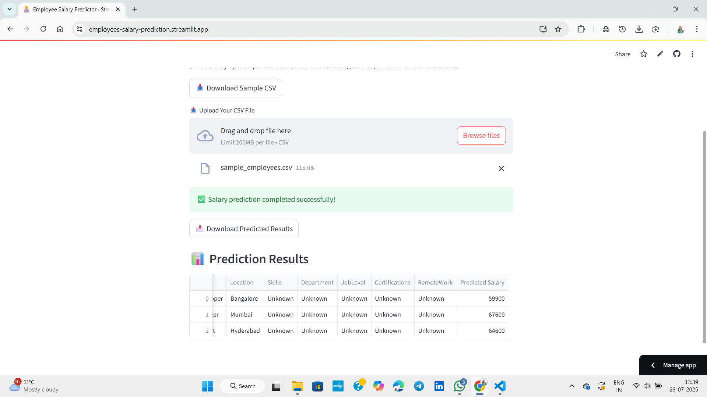

# 👨‍💼 Employee Salary Prediction using Machine Learning

This project predicts employee salaries based on features like experience, education level, job role, and more. Built using Python, Streamlit, and machine learning models from scikit-learn.

## 🔍 Overview

This app helps HR departments and companies estimate salary ranges for employees or new candidates using a machine learning model trained on employee data.

- 🔧 Built with: **Python**, **scikit-learn**, **Streamlit**
- 📊 Model: Trained with **Random Forest Regressor**
- 🧠 Features used: Experience, Education, Role, Location, Skills, Department, Job Level, Certifications, Remote Work
- 📈 Scales features using MinMaxScaler
- 🧮 Encodes categorical data using OneHotEncoder

## 🚀 Live App 
[Click here to use the app](https://employees-salary-prediction.streamlit.app/)

---

## 🖥️ Screenshots







---

## 📁 Project Structure

```
Employee_Salary_Prediction/
│
├── app.py                  # Streamlit app script
├── train_model.py          # Model training script
├── model.pkl               # Trained ML model
├── encoder_scaler.pkl      # Scaler and encoder file
├── columns.pkl             # Column headers used in training
├── data.csv                # Dataset used for training
├── requirements.txt        # Python dependencies
└── README.md               # Project documentation
```

## ⚙️ How to Run Locally

1. **Clone the repository**

```bash
git clone https://github.com/surekhapamulapati/Employees_Salary_Prediction.git
cd Employees_Salary_Prediction
```

2. **Create a virtual environment**

```bash
python -m venv .venv
```

3. **Activate the environment**

- **Windows**:
```bash
.venv\Scripts\activate
```

- **Mac/Linux**:
```bash
source .venv/bin/activate
```

4. **Install dependencies**

```bash
pip install -r requirements.txt
```

5. **Run the app**

```bash
streamlit run app.py
```

---

## 🧠 Model Training

The model is trained on the dataset (`data.csv`) using a **Random Forest Regressor**. It uses one-hot encoded and scaled input features to predict salaries and is saved as `model.pkl` using `joblib`.

---

## 🛠️ Tools & Technologies

* Python  
* Streamlit  
* Pandas  
* scikit-learn  
* NumPy  
* Matplotlib / Seaborn (optional for visualizations)

---

## 📦 Deployment

You can deploy this app on [Streamlit Cloud](https://streamlit.io/cloud) by connecting your GitHub repo and setting the main file to `app.py`.

---

## 🤝 Contributing

Feel free to fork the project, open issues, or submit pull requests to improve this app.

## 📄 License

This project is licensed under the MIT License.

---

## 🙋‍♀️ Author

Made with ❤️ by [Surekha Pamulapati](https://github.com/surekhapamulapati)